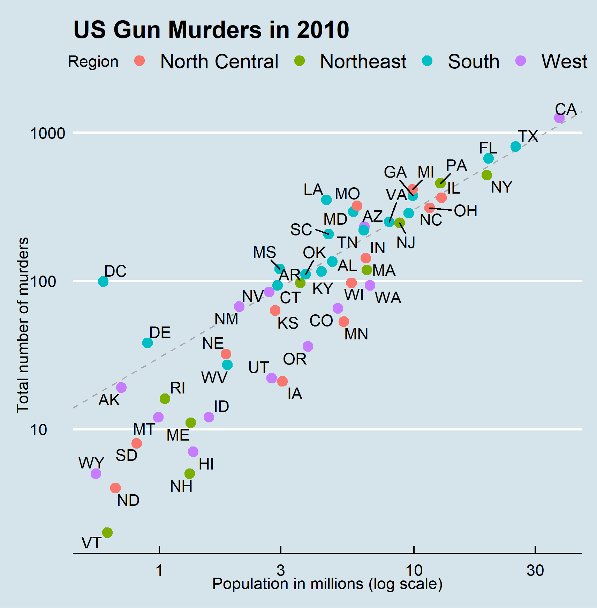

```{r setup, include=FALSE}
knitr::opts_chunk$set(echo = TRUE)
```

## Introduction

This is a quick report on 2010 gun murder rates obtained from FBI reports. The original data was obtained from [this Wikipedia page](https://en.wikipedia.org/wiki/Murder_in_the_United_States_by_state). I have added a few things to the original project by Rafael Irizarry. This is part of my learning in the "Harvardx: Professional Certificate in Data Science" mooc.

I am using the following R libraries: tidyverse, ggplot, ggrepel, ggthemes, & dplyr.

```{r loading-libs, message=FALSE, echo=FALSE}
library(tidyverse)
library(ggthemes)
library(ggrepel)
library(dplyr)
library(ggplot2)
```

Load the wrangled data from rda/murders.rda

```{r, echo=FALSE}
load("rda/murders.rda")
```

## Murder rate by state per 100,000 in population.

Note the large state to state variability by generating a barplot showing the gun murder rate by state:

```{r murder-rate-by-state, echo=FALSE}
murders %>% mutate(abb = reorder(abb, rate)) %>% 
  ggplot(aes(abb, rate)) +
  geom_bar(width = 0.5, stat = "identity", color = "black") +
  coord_flip()
```

## US Gun Murders 2010 average rate per million.

I compute the average murder rate per million in population.

```{r average-murder-rate-per-million, echo=FALSE}
r <- murders %>% 
  summarize(rate = sum(total) /  sum(population) * 10^6) %>%
  pull(rate)
r
```

## Visualize the data

A color coordinated graph of each state compared to the average gun murder rate in log scale.

```{r pressure, echo=FALSE, out.width='100%'}

```

